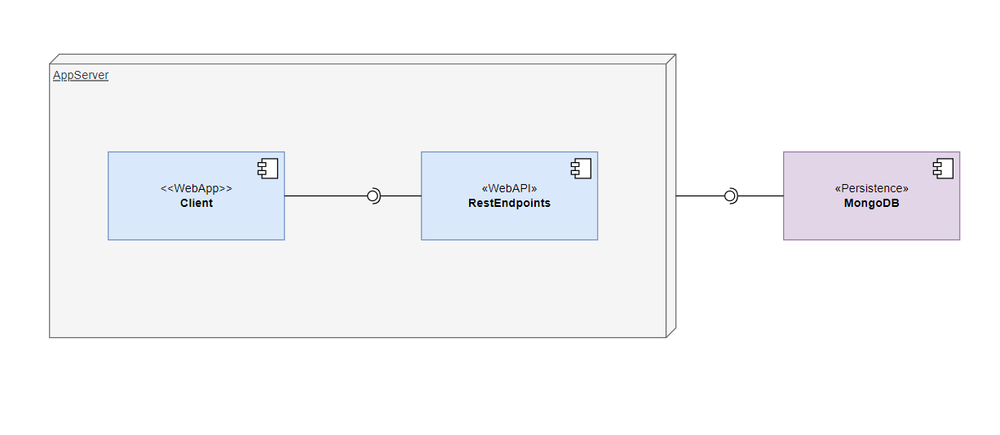

# Final Assessment (FullStack WebApp)

Application provides the **Create Account** and **Login** functionalities.
It is shipped as docker image.

## Architecture  Context

Application consists of the below components,

- [Client (React SPA)](#client)
- [APIServer (Node Express RestEndpoints)](#apiserver)
- [Database (MongoDB)](#apiserver)



## Client

Client is SPA developed using the **ReactJS**.

Below are the main libraries used,
| Name                  | Description                                          | Reference                                                     |
| --------------------- | ---------------------------------------------------- | ------------------------------------------------------------- |
| ReactJs               | A JavaScript library for building user interfaces    | https://reactjs.org                                           |
| Formik                | Used  for building and managing the form React app   | https://formik.org/                                           |
| React-Router          | Used for providing the routing capability            | https://reactrouter.com/                                      |
| Material UI           | Provides the UI components                           | https://mui.com/material-ui/                                  |
| Jest                  | Testing Framework provides test runner and assertion | https://jestjs.io/                                            |
| React Testing Library | Used for testing the react components                | https://testing-library.com/docs/react-testing-library/intro/ |

### Tests Covered

- Create account
- Trying account with email already used by other account
- Login
- Trying to login with email that does not exists
- Trying to login with incorrect password

## APIServer

API Server is developed using the **ExpressJS(node)**.

| Name      | Description                                                       | Reference                                |
| --------- | ----------------------------------------------------------------- | ---------------------------------------- |
| ExpressJs | Provides minimalist web framework for Node.js                     | https://expressjs.com/                   |
| Mongoose  | Used for mongodb object modeling for node.js                      | https://mongoosejs.com/                  |
| Jest      | Testing Framework provides test runner and assertion              | https://jestjs.io                        |
| Helmet    | helps in secure your Express apps by setting various HTTP headers | https://helmetjs.github.io/              |
| SuperTest | provide a high-level abstraction for testing HTTP                 | https://github.com/visionmedia/supertest |

### Tests Covered

- POST /api/users/create
  - request create endpoint with user details
  - request create endpoint with conflicting details
- POST /api/users/login
  - request user login with email not exists
  - request user login with incorrect password
  - request user login with valid email and password

## Database

To Persist the user information database solution used is **MongoDB**.
MongoDB is used because it is very easy use with nodejs.

## Deployment

Here both client and API server bundled to single web server. Whole application is shipped as the docker image.

## Getting Started

Below are the steps to run the application locally
 - Prerequisites needs to installed in the system
    * NodeJs(16)
    * Yarn
    * Docker with Docker compose
 - Install dependencies
   ``` 
   yarn install // yarn needs to used because the workspace used manages the dependencies of both client and server
   ```

 - Start the application including the database using the docker compose
   ```
      yarn run docker:compose:up
   ```

Below are the steps to run tests
 - Assuming the all the prerequisites and dependencies from above
 - create *.env.test* file in the folder *server* with below content
   ```
     JWT_SECRET_KEY="test_secret_@123"
   ```
 - Run command
   ```
      yarn test
   ```
